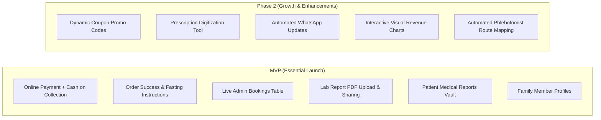

# Blood Panda - Non-Technical Feature Decision Guide & Ticker

This guide translates every technical feature and stub code into plain, business-friendly terms. Use the decision checkboxes (`[ ]`) to tick off what is **Must-Have (MVP)**, **Nice-to-Have (Phase 2)**, or **Not Needed**.

---

## 📋 Feature Decision Ticker Summary

| Category | Feature Name | Plain English Summary | Recommended Priority | Decision |
| :--- | :--- | :--- | :--- | :--- |
| **Checkout** | Online Payment (UPI/Cards) | Accept Google Pay, PhonePe, Paytm, Cards & Net Banking | 🟢 **Must-Have (MVP)** | `[ ] Keep` `[ ] Skip` |
| **Checkout** | Cash on Sample Collection (COD) | Patient pays the collector in cash/UPI when sample is taken | 🟢 **Must-Have (MVP)** | `[ ] Keep` `[ ] Skip` |
| **Checkout** | Clear Order Confirmation Screen | Shows appointment time, address, and fasting rules | 🟢 **Must-Have (MVP)** | `[ ] Keep` `[ ] Skip` |
| **Checkout** | Payment Retry & Fallback | If online payment fails, patient can retry or switch to COD | 🟢 **Must-Have (MVP)** | `[ ] Keep` `[ ] Skip` |
| **Checkout** | Automated Email & SMS Receipts | Automatic invoice and booking confirmation to patient | 🟡 **High Priority** | `[ ] Keep` `[ ] Skip` |
| **Checkout** | Promotional Discount Coupons | Allow marketing promo codes (e.g., `FIRST50`, `HEALTH20`) | 🟡 **Phase 2** | `[ ] Keep` `[ ] Skip` |
| **Checkout** | Home Collection Fee Breakdown | Show sample collection fee (e.g. Free above ₹500) | 🟢 **Must-Have (MVP)** | `[ ] Keep` `[ ] Skip` |
| **Admin** | Real-time Business Metrics | See daily revenue, bookings count, and pending tests | 🟢 **Must-Have (MVP)** | `[ ] Keep` `[ ] Skip` |
| **Admin** | Visual Revenue & Sales Charts | Interactive charts showing growth and popular test packages | 🟡 **Phase 2** | `[ ] Keep` `[ ] Skip` |
| **Admin** | Live Bookings Management Table | View all orders, filter by status, and search patients | 🟢 **Must-Have (MVP)** | `[ ] Keep` `[ ] Skip` |
| **Admin** | Test Status Workflow | Move orders: *Confirmed $\rightarrow$ Sample Taken $\rightarrow$ In Lab $\rightarrow$ Done* | 🟢 **Must-Have (MVP)** | `[ ] Keep` `[ ] Skip` |
| **Admin** | Sample Collector Assignment | Assign a phlebotomist technician to visit the patient's home | 🟡 **High Priority** | `[ ] Keep` `[ ] Skip` |
| **Admin / Field** | Time Slot Rescheduling (Manual Comms) | Technician calls customer, agrees on new time, and updates slot in app | 🟢 **Must-Have (MVP)** | `[ ] Keep` `[ ] Skip` |
| **Admin** | Lab Report PDF Uploader | Upload test report PDF and automatically notify the patient | 🟢 **Must-Have (MVP)** | `[ ] Keep` `[ ] Skip` |
| **Admin** | Patient Directory & History | View patient profile, past blood tests, and spending | 🟡 **High Priority** | `[ ] Keep` `[ ] Skip` |
| **Admin** | Prescription Digitization Tool | Admin views prescription photo and builds a cart for patient | 🟡 **High Priority** | `[ ] Keep` `[ ] Skip` |
| **Admin** | Payment Reconciliation & Refunds | Process refunds for cancelled tests and check stuck payments | 🟡 **High Priority** | `[ ] Keep` `[ ] Skip` |
| **Admin** | Instant Inquiries & Leads CRM | Manage callback requests and quick booking leads | 🟡 **Phase 2** | `[ ] Keep` `[ ] Skip` |
| **User Portal** | Live Appointment Tracker | Patient tracks phlebotomist arrival and test progress | 🟡 **High Priority** | `[ ] Keep` `[ ] Skip` |
| **User Portal** | Digital Medical Reports Vault | Patient views and downloads PDF blood test results anytime | 🟢 **Must-Have (MVP)** | `[ ] Keep` `[ ] Skip` |
| **User Portal** | Prescription Upload & Review | Patient uploads doctor's prescription for lab review | 🟡 **High Priority** | `[ ] Keep` `[ ] Skip` |
| **User Portal** | Family Member Profiles | Book tests for self, spouse, kids, and elderly parents | 🟢 **Must-Have (MVP)** | `[ ] Keep` `[ ] Skip` |
| **User Portal** | Saved Address Book | Save multiple locations (Home, Parents' Home, Office) | 🟢 **Must-Have (MVP)** | `[ ] Keep` `[ ] Skip` |

---

## 1. Checkout & Payment Experience

### 1.1 Online Payment Gateway (Cashfree Payments / UPI / Cards / Net Banking)
* **What it is**: Allows patients to pay immediately during booking using **Cashfree Payment Gateway** supporting all major UPI apps (Google Pay, PhonePe, Paytm, BHIM, CRED), Credit/Debit Cards (Visa, Mastercard, RuPay), Net Banking (50+ banks), and Wallets/PayLater.
* **Why it matters**: Increases upfront conversions, avoids phlebotomists having to collect cash, and reduces booking no-shows.
* **Recommendation**: **Must-Have (MVP)**
* **Your Decision**:
  - [ ] **Must-Have (MVP)**: Enable full Cashfree Payment Gateway integration.
  - [ ] **Skip for now**: Only allow Pay at Home (COD).

---

### 1.2 Cash on Collection / Pay at Home (COD)
* **What it is**: Patients place a booking without paying immediately; they pay the technician when they arrive at their home.
* **Why it matters**: Essential for elderly patients or customers who prefer paying after the phlebotomist arrives.
* **Recommendation**: **Must-Have (MVP)**
* **Your Decision**:
  - [ ] **Must-Have (MVP)**: Keep COD enabled alongside online payments.
  - [ ] **Skip**: Strictly online prepaid bookings only.

---

### 1.3 Order Confirmation Screen with Fasting Guidelines
* **What it is**: A clean screen shown right after payment/booking showing:
  - Booking ID & Phlebotomist visit time slot.
  - Home address confirmed for blood draw.
  - Clear medical fasting instructions (e.g., *"10-12 hours fasting required for this test"*).
  - Downloadable invoice/receipt.
* **Why it matters**: Prevents test cancellations caused by patients eating before fasting tests, and reassures them the order went through.
* **Recommendation**: **Must-Have (MVP)**
* **Your Decision**:
  - [ ] **Must-Have (MVP)**
  - [ ] **Basic version**: Simple thank-you message only.

---

### 1.4 Smart Payment Failure & Retry Recovery
* **What it is**: If a bank server fails or a UPI payment drops, the patient sees a "Payment Incomplete" screen with a one-click button to retry or switch to COD without re-entering all patient details.
* **Why it matters**: Recovers 15–25% of lost revenue from failed transactions.
* **Recommendation**: **Must-Have (MVP)**
* **Your Decision**:
  - [ ] **Must-Have (MVP)**
  - [ ] **Phase 2**

---

### 1.5 Automated Invoice Email & WhatsApp/SMS Alerts
* **What it is**: Sends a branded PDF receipt to the patient's email and a WhatsApp/SMS alert with appointment details and phlebotomist contact.
* **Why it matters**: Professional branding and ensures patients remember their morning collection time.
* **Recommendation**: **High Priority**
* **Your Decision**:
  - [ ] **Email only (MVP)**
  - [ ] **Email + SMS / WhatsApp (Phase 2)**
  - [ ] **Skip**

---

### 1.6 Marketing Promo Codes & Coupons
* **What it is**: Enables promo codes (e.g. `WELCOME10`, `HEALTH500`) with minimum cart values, percentage or flat discounts, and expiration dates.
* **Why it matters**: Useful for marketing campaigns and festive health checkup promotions.
* **Recommendation**: **Phase 2 (Nice-to-Have)**
* **Your Decision**:
  - [ ] **Phase 2**: Add dynamic coupon system later.
  - [ ] **MVP**: Need promo codes immediately for launch.
  - [ ] **Not needed**: Flat pricing only.

---

## 2. Admin Operations & Lab Dashboard

### 2.1 Live Daily Operations & Revenue Metrics
* **What it is**: A summary header showing:
  - Today’s revenue (Online vs Cash).
  - Number of home sample pickups scheduled for today.
  - Samples collected and waiting for lab analysis.
  - Reports ready to be dispatched.
* **Why it matters**: Gives lab managers an instant pulse on daily business without opening spreadsheets.
* **Recommendation**: **Must-Have (MVP)**
* **Your Decision**:
  - [ ] **Must-Have (MVP)**
  - [ ] **Phase 2**

---

### 2.2 Live Bookings Management & Status Workflow
* **What it is**: A master table of all patient bookings where lab staff can update progress through 4 key stages:
  1. `Confirmed` $\rightarrow$ Booking accepted.
  2. `Sample Collected` $\rightarrow$ Phlebotomist visited home and took blood vials.
  3. `Processing in Lab` $\rightarrow$ Lab analyzers running tests.
  4. `Report Ready / Completed` $\rightarrow$ Test report published.
* **Why it matters**: The core operational backbone for running home blood test services.
* **Recommendation**: **Must-Have (MVP)**
* **Your Decision**:
  - [ ] **Must-Have (MVP)**
  - [ ] **Simplified**: Only Pending and Completed statuses.

---

### 2.3 Sample Collector (Phlebotomist) Assignment
* **What it is**: Assigning a specific field technician / phlebotomist to a booking with their name and phone number.
* **Why it matters**: Allows the patient to know who is coming and enables the admin to track which technician handled which sample.
* **Recommendation**: **High Priority**
* **Your Decision**:
  - [ ] **High Priority**: Phlebotomist assignment and tracking.
  - [ ] **Phase 2**: Admin manages technicians offline via phone.

---

### 2.4 Phlebotomist Time Slot Rescheduling (Manual Communication Flow)
* **What it is**: Allows the field technician or lab admin to call the customer directly (e.g. if the customer requests a different morning hour, or technician faces traffic/routing delays), agree on a mutually convenient new time, and update the date/slot in the system.
* **Why it matters**: Field operations frequently require flexible timing adjustments. Having this directly in the app keeps the dispatch queue accurate and sends an updated SMS/WhatsApp reminder to the patient.
* **Recommendation**: **Must-Have (MVP)**
* **Your Decision**:
  - [ ] **Must-Have (MVP)**: Quick reschedule modal for technician/admin with communication notes.
  - [ ] **Phase 2**: Enable customer self-rescheduling from the customer portal as well.

---

### 2.5 Lab Report PDF Uploader & Patient Delivery
* **What it is**: Lab staff clicks on a booking, uploads the PDF test results file, and the system automatically notifies the patient and makes it downloadable in their portal.
* **Why it matters**: Eliminates manual emailing or printing of blood test reports.
* **Recommendation**: **Must-Have (MVP)**
* **Your Decision**:
  - [ ] **Must-Have (MVP)**
  - [ ] **Skip**: Send reports manually over WhatsApp/Email outside the website.

---

### 2.6 Prescription Digitization & Booking Generator
* **What it is**: When a patient uploads a photo of a doctor's handwritten prescription:
  - Admin views the prescription image in the dashboard.
  - Admin picks the matching tests from the catalog.
  - Admin clicks "Send Booking Link" to the patient via SMS/WhatsApp so the patient can simply approve and pay.
* **Why it matters**: A major driver for elderly patients or patients who don't know the exact medical names of their tests.
* **Recommendation**: **High Priority**
* **Your Decision**:
  - [ ] **High Priority**: Build prescription review tool.
  - [ ] **Phase 2**: Handle prescription inquiries via manual phone call.

---

### 2.7 Refund & Payment Ledger
* **What it is**: View all payments, search by transaction ID, verify stuck payments, and issue refunds directly if a patient cancels.
* **Why it matters**: Essential for financial accounting and customer service handling.
* **Recommendation**: **High Priority**
* **Your Decision**:
  - [ ] **High Priority**
  - [ ] **Phase 2**

---

## 3. Patient / Customer Self-Service Portal

### 3.1 Live Appointment & Report Tracker
* **What it is**: Patients log into their profile to see their upcoming home blood collections, who their assigned phlebotomist is, and when their reports are expected.
* **Why it matters**: Reduces repetitive "Where is my report?" customer support calls by 60%.
* **Recommendation**: **High Priority**
* **Your Decision**:
  - [ ] **High Priority**
  - [ ] **Phase 2**

---

### 3.2 Digital Medical Reports Vault
* **What it is**: A secure digital archive where patients can access, view, and download all past lab test reports across years.
* **Why it matters**: Major value-add for patient retention and chronic disease monitoring (diabetes, thyroid, cholesterol).
* **Recommendation**: **Must-Have (MVP)**
* **Your Decision**:
  - [ ] **Must-Have (MVP)**
  - [ ] **Phase 2**

---

### 3.3 Family Members Profile Manager
* **What it is**: Allows one primary user (e.g. head of household) to add multiple family members (e.g. Father 65M, Mother 60F, Child 10M) and book specific packages for each in a single checkout.
* **Why it matters**: Diagnostic tests are frequently booked by adult children for their elderly parents or entire families.
* **Recommendation**: **Must-Have (MVP)**
* **Your Decision**:
  - [ ] **Must-Have (MVP)**
  - [ ] **Single person only**

---

### 3.4 Saved Address Book
* **What it is**: Saves home, office, and parents' addresses with landmark and pincode for quick one-click re-ordering.
* **Why it matters**: High convenience for repeat home blood collection bookings.
* **Recommendation**: **Must-Have (MVP)**
* **Your Decision**:
  - [ ] **Must-Have (MVP)**
  - [ ] **Phase 2**

---

## 4. Suggested MVP vs Phase 2 Scope

---

## 5. Next Steps

1. Review the options in this ticker guide and confirm which features you want included in **MVP (Phase 1)** vs **Phase 2**.
2. We will then implement the approved MVP features directly in your codebase starting with the payment gateway checkout fix and the admin bookings table.
