# Blood Panda - Payment Gateway, Checkout & Dashboard Implementation Roadmap

This document outlines all current stub implementations, mockups, missing features, architectural gaps, and a step-by-step roadmap to build a production-ready **Payment Gateway**, **Checkout Workflow**, **Admin Operations Dashboard**, and **User Customer Dashboard**.

---

## 1. Executive Summary of Current Stub State

| Component / Workflow | Current Status | Key Missing Implementation |
| :--- | :--- | :--- |
| **API Payment Checkout** (`/api/payment/checkout`) | 🔴 Empty Stub | Returns static `success` without initializing gateway order |
| **API Webhook Callback** (`/api/payment/callback`) | 🟡 Partial Stub | Only handles `CHECKOUT_ORDER_COMPLETED`, no failure/refund/idempotency |
| **Payment Success Page** (`/_protected/payment-success`) | 🔴 Empty Stub | Renders placeholder string `<div>Hello...</div>` |
| **Payment Failure / Cancel Page** | 🔴 Missing | No route for failed transactions or payment retry flows |
| **Checkout UI Payment Methods** (`review-step.tsx`) | 🟡 Incomplete | Only `COD` listed; `ONLINE_PAYMENT` is absent from UI |
| **Cart Coupon System** (`cart-order-summary.tsx`) | 🟡 Hardcoded | Static code `PROMO30`; no DB coupon validation or limits |
| **Payment Flow Error Handling** (`booking.functions.ts`) | 🔴 Buggy | `createCheckOutLink` redirect is caught by try/catch and fails |
| **Admin Dashboard KPIs** (`dashboard.tsx`, `section-cards.tsx`) | 🟡 Mock/Partial | Hardcoded stats, commented-out cards, debug JSON |
| **Admin Analytics Charts** (`chart-area-interactive.tsx`) | 🔴 Hardcoded Mock | 100% hardcoded April–June 2024 sample data |
| **Admin Bookings Table** (`_admin/bookings.tsx`) | 🔴 Mock Data | Reads static `data.json` instead of live Prisma DB |
| **Admin Patients View** (`_admin/patients.tsx`) | 🔴 Mock Data | Reads static `data.json`; no real patient records |
| **Admin Prescriptions View** (`_admin/prescriptions.tsx`) | 🔴 Mock Data | Reads static `data.json`; no prescription digitization tool |
| **Admin Subscribers View** (`_admin/subscribers.tsx`) | 🔴 Mock Data | Reads static `data.json`; no subscriber table in DB |
| **User Profile & Order History** (`_protected/profile.tsx`) | 🔴 Mock/Skeletons | Mock order & report lists; all modal dialogs are skeleton UI |

---

## 2. Payment Gateway & Checkout Workflow

### 2.1 API Endpoints & Gateway Integration
- [ ] **Fix TanStack Start Checkout Redirect Bug**:
  - `createBookingRecord` in `src/lib/booking.functions.ts` catches the `redirect()` thrown by `createCheckOutLink` inside its `try/catch` block and re-throws it as an error.
  - *Fix*: Allow redirect exceptions to propagate or return the checkout URL explicitly to the client.
- [ ] **Complete API Checkout Handler (`src/routes/api/payment/checkout.ts`)**:
  - Implement full request schema validation with Zod (cart items, member details, slot time, address).
  - Session verification using `authMiddleware`.
  - Create `PENDING` booking in database before redirecting to payment gateway.
  - Integrate **Cashfree Payments** Node.js SDK (`@cashfreepayments/cashfree-sdk` / PG Orders API `POST /pg/orders`) to generate `payment_session_id` and hosted checkout URL.
- [ ] **Production-Ready Webhook Callback Handler (`src/routes/api/payment/callback.ts`)**:
  - **Cashfree Signature Verification**: Validate `x-webhook-signature` and `x-webhook-timestamp` using Cashfree SDK / webhook secret.
  - **Idempotency**: Prevent duplicate processing of retry webhook events.
  - **State Machine Transitions**:
    - `PAYMENT_SUCCESS_WEBHOOK` $\rightarrow$ Mark Payment `PAID`, Booking `CONFIRMED`.
    - `PAYMENT_FAILED_WEBHOOK` / `PAYMENT_USER_DROPPED_WEBHOOK` $\rightarrow$ Mark Payment `FAILED`, Booking `PAYMENT_FAILED`.
    - `REFUND_SUCCESS_WEBHOOK` $\rightarrow$ Mark Payment `REFUNDED`, Booking `CANCELLED`.
  - **Automated Post-Payment Actions**:
    - Trigger `PurchaseReceiptEmail` using React Email.
    - Send SMS/WhatsApp confirmation with appointment details to patient.
    - Dispatch notification to admin/phlebotomist dashboard.
- [ ] **Payment Status Verification & Polling Server Function**:
  - Implement `checkPaymentStatusServerFn(orderId)` to query Cashfree's Order Fetch API (`GET /pg/orders/{order_id}`) when user lands on success page before webhook arrives.
- [ ] **Refund Workflow**:
  - Implement `initiateRefundFn(bookingId, reason)` for admin cancellations.
  - Call Cashfree Refund API (`POST /pg/orders/{order_id}/refunds`) with merchant refund ID and amount.

### 2.2 Frontend Checkout & Booking Wizard
- [ ] **Payment Options Selector (`src/features/booking/review-step.tsx`)**:
  - Add **Online Payment (Cashfree: UPI, Cards, Net Banking, Wallets)** with visual payment method badges.
  - Add **Cash on Collection (COD)** with clear instructions.
  - Display dynamic fee breakdown:
    - Sample Collection Fee (Free over ₹500, else ₹100).
    - Hardcopy Report Delivery Fee (optional add-on).
    - Applied Coupon Discount.
    - GST / Taxes (if applicable).
- [ ] **Real Dynamic Coupon / Promo Code Engine**:
  - Migrate away from hardcoded `PROMO30`.
  - Add server function `validateCoupon({ code, cartTotal })`.
  - Support percentage discounts, flat discounts, minimum order value, and user-specific single-use promo codes.
- [ ] **Payment Success Page (`src/routes/_protected/payment-success.tsx`)**:
  - Replace placeholder `<div>Hello...</div>` with a rich confirmation screen:
    - **Booking Reference ID** and Payment Transaction ID.
    - **Appointment Schedule**: Date, Time Slot, Home Collection Address.
    - **Patient & Test Summary**: List of tests booked per family member.
    - **Pre-Test Fasting Guidelines**: Clear alerts (e.g., 10-12 hr fasting required for Lipid/Blood Sugar).
    - **Actions**:
      - "Download Invoice / Receipt PDF".
      - "Track Phlebotomist".
      - "Go to My Bookings".
- [ ] **Payment Failure & Cancellation Page (`src/routes/_protected/payment-failed.tsx`)**:
  - Detailed failure reason (insufficient funds, gateway timeout, user aborted).
  - "Retry Payment" button preserving existing cart and booking details.
  - "Switch to Pay on Collection (COD)" instant one-click option.

---

## 3. Admin Operations Dashboard (`/_admin/*`)

### 3.1 Live Analytics & KPI Metrics (`src/features/admin/components/*`)
- [ ] **Section KPI Cards (`section-cards.tsx`)**:
  - Clean up debug code and commented markup.
  - Connect cards to live Prisma aggregates:
    - **Total Revenue (INR)**: Sum of all `CONFIRMED` / `PAID` payments.
    - **Active Bookings**: Count of `PENDING` & `CONFIRMED` visits scheduled for today/this week.
    - **Pending Sample Collections**: Bookings where phlebotomist has not completed sample pickup.
    - **Reports Pending**: Samples collected but lab report PDF not yet uploaded.
- [ ] **Interactive Area Charts (`chart-area-interactive.tsx`)**:
  - Replace hardcoded static date array with live Prisma time-series query:
    - Daily / Weekly / Monthly revenue breakdown.
    - Online Payment vs COD ratio.
    - Peak booking hours / time-slot heatmaps.

### 3.2 Bookings Management (`src/routes/_admin/bookings.tsx`)
- [ ] **Live Bookings Data Table**:
  - Query real Prisma `Booking` records with connected `User`, `Member`, `Address`, `Schedule`, and `Payment`.
  - Filters: Status (`PENDING`, `CONFIRMED`, `COLLECTED`, `COMPLETED`, `CANCELLED`), Payment Mode (`COD`, `ONLINE`), Date Range.
  - Search by: Patient Name, Phone Number, Booking ID, City/Pincode.
- [ ] **Booking Detail & Action Drawer**:
  - View full patient roster and individual tests assigned.
  - **Status Transition Workflow**:
    1. `CONFIRMED` $\rightarrow$ Phlebotomist Assigned.
    2. `SAMPLE_COLLECTED` $\rightarrow$ Phlebotomist confirms barcode / sample collection.
    3. `IN_LAB` $\rightarrow$ Laboratory processing sample.
    4. `REPORT_UPLOADED` $\rightarrow$ PDF attached, notification sent.
  - **Actions**:
    - **Upload Lab Report PDF**: Attaches report to booking and notifies user.
    - **Reschedule Sample Collection Slot (Manual Comms)**: Technician calls patient $\rightarrow$ Agrees on new time $\rightarrow$ Updates `Schedule` (Date & Slot) in app with communication notes $\rightarrow$ Triggers updated booking confirmation to patient.
    - **Mark COD Payment as Collected**: Record cash/UPI received + technician name.
    - **Initiate Full/Partial Refund**: Cancel appointment and trigger Cashfree refund.

### 3.3 Patients & Medical Records (`src/routes/_admin/patients.tsx`)
- [ ] **Unified Patient Directory**:
  - Combined listing of registered account users and guest booking members.
  - Search by Name, Email, Mobile, Blood Group.
- [ ] **Patient Profile View**:
  - Past booking history & expenditure.
  - Cumulative test report history (e.g. Glucose levels over time, Lipid profiles).
  - Stored emergency contacts and home addresses.

### 3.4 Prescription Digitization Tool (`src/routes/_admin/prescriptions.tsx`)
- [ ] **Prescription Review Queue**:
  - Display pending doctor prescriptions uploaded by users.
  - Image viewer with zoom, pan, rotate, and full-screen preview.
- [ ] **"Convert Prescription to Cart / Booking" Wizard**:
  - Admin/Pharmacist searches the test catalog and selects tests prescribed in the image.
  - System generates a pre-filled booking draft.
  - Sends a secure SMS / WhatsApp / Email link to user: *"Your prescription has been reviewed. Click here to approve tests and pay."*

### 3.5 Payments & Webhooks Ledger (`src/routes/_admin/payments.tsx`)
- [ ] **Transactions Audit Log**:
  - Full table of `Payment` records: Merchant Order ID, Gateway Transaction ID, State, Amount, Currency, Date.
  - Gateway Sync button: queries Cashfree API to resolve stuck `PENDING` states.
- [ ] **Webhook Logs Explorer**:
  - Inspect raw JSON payloads stored in `WebhookLog` for troubleshooting gateway communication.

---

## 4. Customer / User Dashboard (`/_protected/profile.tsx`)

### 4.1 Orders & Appointments Tab
- [ ] **Live Booking Tracker**:
  - Replace static `Array.from({ length: 3 })` with live query for `user.bookings`.
  - Timeline visualizer: *Order Placed $\rightarrow$ Phlebotomist Assigned $\rightarrow$ Sample Collected $\rightarrow$ Processing in Lab $\rightarrow$ Report Ready*.
  - Action buttons: "Download Invoice", "Cancel / Reschedule Booking", "View Phlebotomist Contact".

### 4.2 Diagnostic Reports Tab
- [ ] **Live Reports List & Viewer (`view-report-dialog.tsx`)**:
  - Replace skeleton dialog with PDF viewer (using PDF.js or browser iframe).
  - One-click report download with password protection (DOB / Mobile).
  - Email Report button (sends PDF copy to user's registered email).

### 4.3 Prescriptions Tab
- [ ] **Upload & Manage Prescriptions (`upload-user-prescription-dialog.tsx`)**:
  - Connect file picker to cloud storage (S3 / Cloudinary / R2 presigned URL upload).
  - Status indicators: `Uploaded`, `Under Doctor Review`, `Tests Recommended`, `Completed`.
  - "View Assigned Tests & Checkout" button when pharmacist finishes review.

### 4.4 Profile & Address Book Dialogs
- [ ] **Edit Profile (`edit-user-profile-dialog.tsx`)**: Update name, avatar, blood group, emergency contact.
- [ ] **Saved Addresses (`update-address-dialog.tsx`)**: Manage Home, Office, and Other addresses with GPS location picker.
- [ ] **Security Settings (`change-user-password-dialog.tsx`)**: Change password via Better Auth API, manage active login sessions.

---

## 5. Database Schema Enhancements (Prisma)

To support the above workflows, the following schema additions are recommended:

```prisma
// Recommended Prisma Schema Updates

model Booking {
  // Existing fields...
  totalAmount         Decimal       @default(0.00) @db.Decimal(10, 2)
  discountAmount      Decimal       @default(0.00) @db.Decimal(10, 2)
  collectionCharge    Decimal       @default(0.00) @db.Decimal(10, 2)
  invoiceNumber       String?       @unique
  cancellationReason  String?
  phlebotomistName    String?
  phlebotomistPhone   String?
  reports             TestReport[]
  prescriptions       Prescription[]
}

model Payment {
  // Existing fields...
  paymentMethod       String?       // UPI, NETBANKING, CARD, WALLET, COD
  gatewayResponseCode String?
  failureReason       String?
  refundId            String?
  refundAmount        String?
  refundStatus        String?       // INITIATED, SUCCESS, FAILED
}

model TestReport {
  id          String    @id @default(dbgenerated("gen_random_uuid()")) @db.Uuid
  bookingId   String    @db.Uuid
  userId      String    @db.Uuid
  title       String
  fileUrl     String
  fileSize    String?
  releasedAt  DateTime  @default(now())
  booking     Booking   @relation(fields: [bookingId], references: [id], onDelete: Cascade)
  user        User      @relation(fields: [userId], references: [id], onDelete: Cascade)
  @@map("test_report")
}

model Prescription {
  id          String             @id @default(dbgenerated("gen_random_uuid()")) @db.Uuid
  userId      String             @db.Uuid
  bookingId   String?            @db.Uuid
  imageUrl    String
  status      PrescriptionStatus @default(PENDING_REVIEW)
  adminNotes  String?
  createdAt   DateTime           @default(now())
  updatedAt   DateTime           @updatedAt
  user        User               @relation(fields: [userId], references: [id], onDelete: Cascade)
  booking     Booking?           @relation(fields: [bookingId], references: [id])
  @@map("prescription")
}

enum PrescriptionStatus {
  PENDING_REVIEW
  TESTS_RECOMMENDED
  ORDER_CREATED
  REJECTED
}

model Coupon {
  id             String    @id @default(dbgenerated("gen_random_uuid()")) @db.Uuid
  code           String    @unique
  discountType   DiscountType @default(PERCENTAGE)
  discountValue  Decimal   @db.Decimal(10, 2)
  minOrderAmount Decimal   @default(0.00) @db.Decimal(10, 2)
  maxDiscount    Decimal?  @db.Decimal(10, 2)
  validUntil     DateTime
  usageLimit     Int?
  usageCount     Int       @default(0)
  isActive       Boolean   @default(true)
  createdAt      DateTime  @default(now())
  @@map("coupon")
}

enum DiscountType {
  PERCENTAGE
  FLAT
}
```

---

## 6. Implementation Phases & Prioritized Roadmap

```mermaid
graph TD
    subgraph "Phase 1: Payment & Checkout Core (P0)"
        A1[Fix Redirect Bug in Booking Functions] --> A2[Add Online Payment Option to Review Step]
        A2 --> A3[Complete Payment Callback & Webhook Verification]
        A3 --> A4[Build Rich Payment Success & Failure Screens]
    end

    subgraph "Phase 2: Admin Operations Dashboard (P1)"
        B1[Replace Mock Bookings Table with Live Prisma Query] --> B2[Implement Status Workflow & Phlebotomist Assignment]
        B2 --> B3[Build PDF Report Upload & Attachment]
        B3 --> B4[Connect KPI Cards & Revenue Analytics Charts]
    end

    subgraph "Phase 3: User Dashboard & Prescriptions (P1)"
        C1[Live Customer Order Tracker] --> C2[PDF Report Download & Emailer]
        C2 --> C3[Prescription Upload & Digitization Flow]
        C3 --> C4[Dynamic Coupon & Discount Engine]
    end
```


